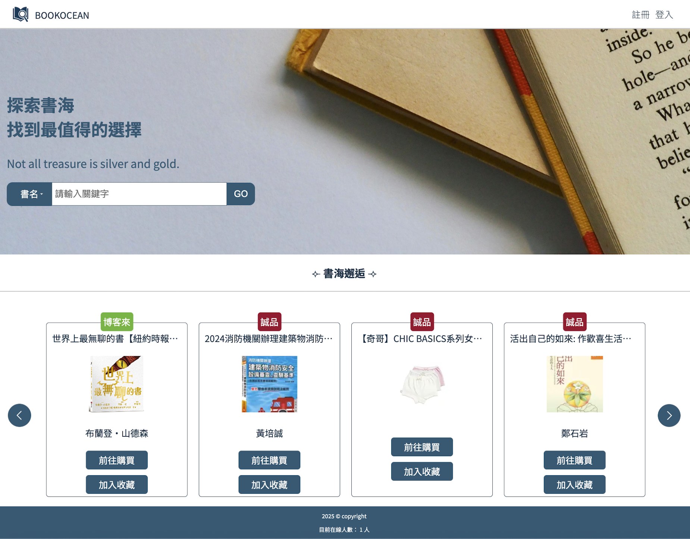
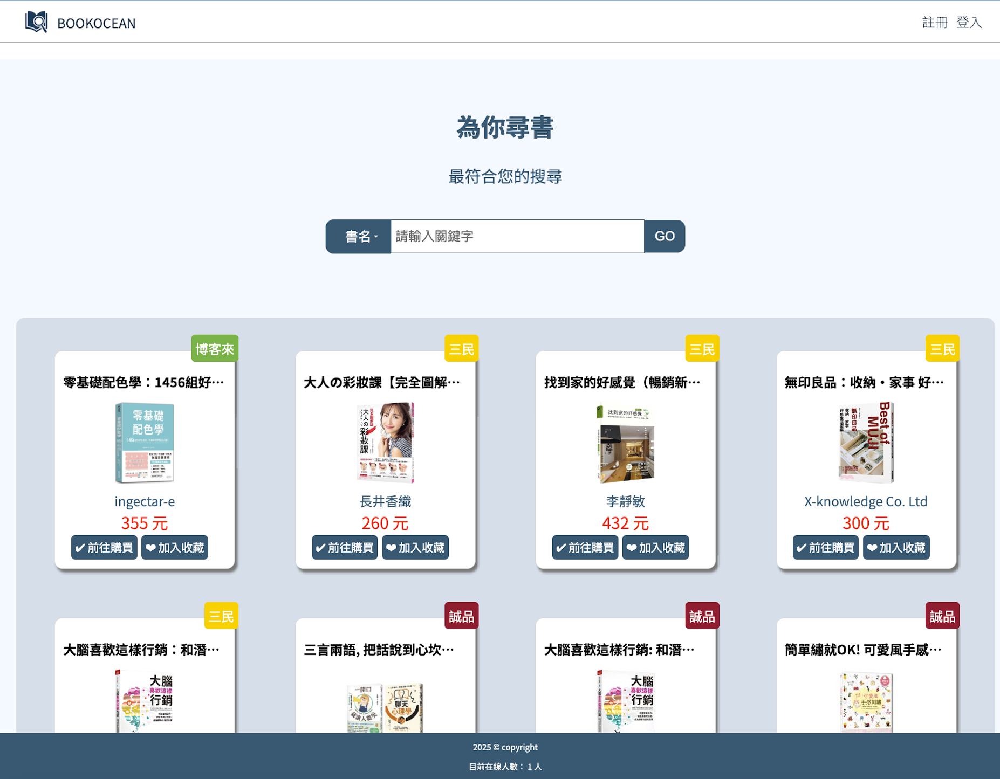
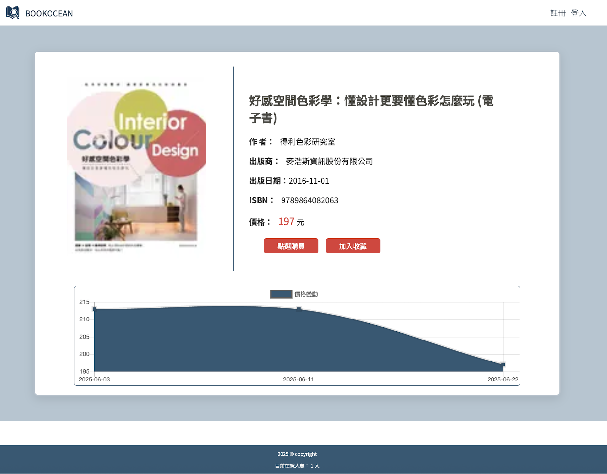
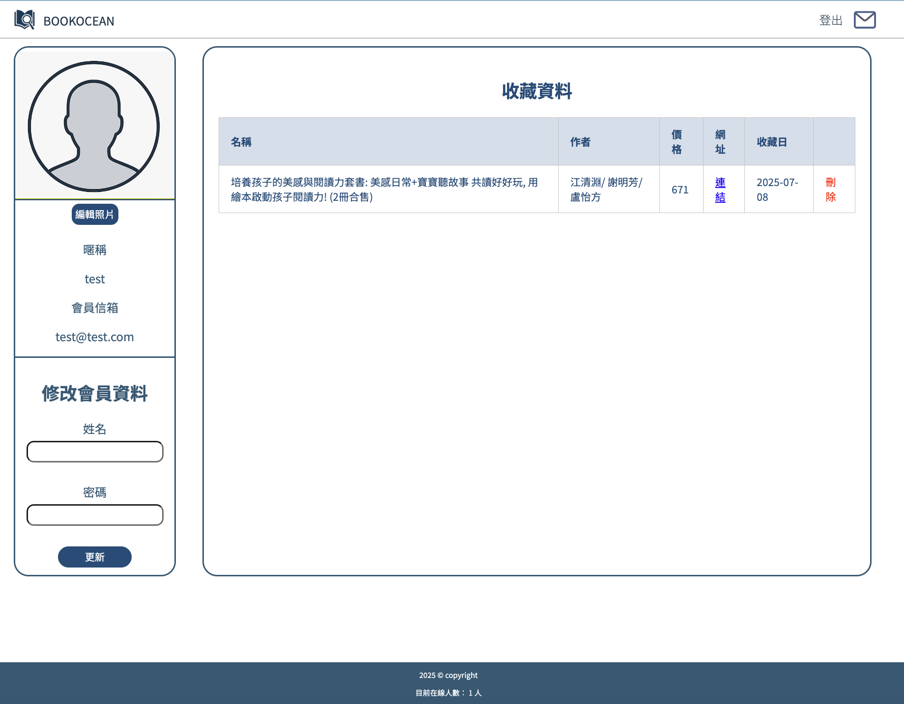
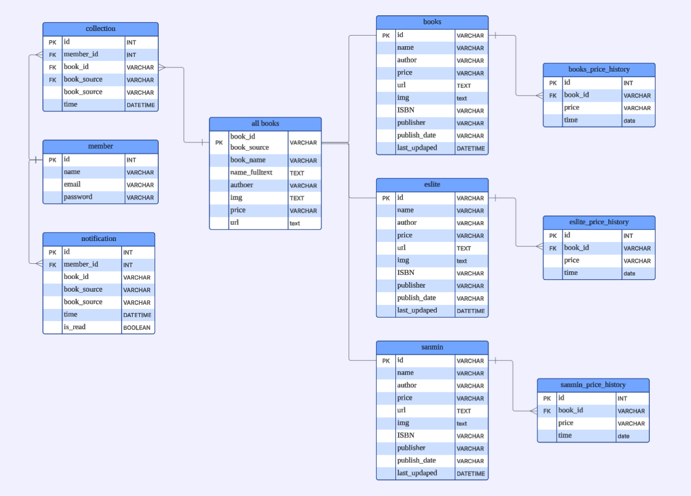

# BookOcean

Welcome to **BookOcean** 

a website that helps you find  the prices of books from different book shops!

This project automatically crawls book data from online bookstores and helps users track book prices and get notified when prices change.

DEMO website : https://interestingthing4all.fit

## Preview ##

## Features

- Independently developed a **full-stack web application**, managing the entire development lifecycle from ideation to cloud deployment.
- Implement a book search feature using **MySQL's** built-in **Full-Text Search** functionality. This involves creating a FU LLTEXT index on
- Develop frequency auto crawling mechanism and cache the data on backend SQL server deployed in **AWS S3** and **CloudFront**.
- Designed and built **RESTful APIs** using FastAPI, and generated clear documentation for the frontend.
- Utilized **Python (FastAPI)** for backend logic and **JavaScript**,**HTML**, and **CSS** for the interactive frontend.
- Implement a real-time online user count with **WebSockets**. The server maintains an accurate total by counting active connections, pushing live updates to all clients as users join or leave.
- Deployed the application within **Docker** on **AWS** and implemented **Continuous Delivery (CD)** with **GitHub Actions**.

## Daily Price Tracking and Notification Process

- Daily Data Crawl

  - A scheduled daily task is executed to automatically crawl the latest book data from online bookstores using the requests and BeautifulSoup libraries.

- Update Book Data and Price

  - The crawled data is used to update book information in the database, with a primary focus on the latest price.

- Check Against User Collections

  - The list of daily updated books is cross-referenced with the "favorites" collection of every user.

- Compare New and Old Prices

  - If an updated book is found in a user's collection, its newly crawled price is compared against the previously stored price.

- Trigger Price Change Notification

  - If a price difference is detected, a price alert notification is generated and sent to the user who has the book in their collection.
  - 
## Architecture

## ERD

## Built With

### FrontEnd
- HTML
- CSS
- JavaScript

### BackEnd
- Python
- FastAPI

### Version Control
- Git

### Deployment & Infrastructure
- Docker
- GitHub
  - Git Action Deploy   
- AWS
  - EC2
  - S3
  - CloudFront
  - RDS (MySQL)
- Nginx

## Disclaimer
This project is for educational and demonstrational purposes only and is not intended for commercial use. All data crawled belongs to the original websites. Users should comply with the terms of service of the respective websites. The author is not responsible for any legal issues arising from improper use.

## Contact

洪瑩縈 HollyHung 

EMAIL: jk699411@gmail.com
